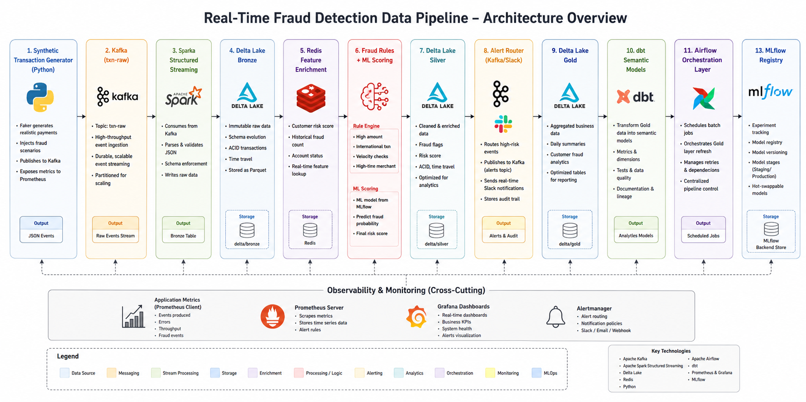

# 🚨 Real-Time Fraud Detection Data Pipeline

<p align="center">


</p>

---

## 📌 Project Overview

This project is a **production-style Real-Time Fraud Detection Pipeline** designed to simulate how modern banks and fintech systems detect fraudulent payment activity in near real time.

The platform ingests streaming transaction events from Kafka, processes them using Spark Structured Streaming, enriches them with customer risk profiles from Redis, applies fraud detection logic and ML scoring, and stores the results using a **Bronze / Silver / Gold Medallion Architecture** on Delta Lake.

The system also includes:

* ⚡ Real-time stream processing
* 📊 Monitoring & observability
* 🤖 MLflow experiment tracking
* 📈 dbt semantic modeling
* 🔄 Airflow orchestration
* 📡 Kafka alert routing
* 🧠 Fraud scoring engine
* 🏗️ Dockerized infrastructure

---

# 🏗️ System Architecture

```text
Synthetic Transaction Generator
            ↓
        Kafka (txn-raw)
            ↓
 Spark Structured Streaming
            ↓
     Delta Lake Bronze
            ↓
 Redis Feature Enrichment
            ↓
 Fraud Rules + ML Scoring
            ↓
     Delta Lake Silver
            ↓
  Alert Router (Kafka/Slack)
            ↓
      Delta Lake Gold
            ↓
     dbt Semantic Models
            ↓
 Airflow Orchestration Layer
            ↓
 Prometheus + Grafana
            ↓
      MLflow Registry
```

---

# 🖼️ Architecture Diagram

> Add your architecture image here

```text
docs/images/architecture.png
```

<p align="center">
  
</p>

---

# 🎯 Business Problem

Traditional fraud detection systems rely on delayed batch processing.

By the time suspicious activity is detected:

* chargebacks already occur,
* losses increase,
* investigation becomes reactive instead of proactive.

This platform demonstrates how to build:

* low-latency fraud pipelines,
* streaming analytics systems,
* scalable event-driven architectures,
* production-style observability and orchestration.

---

# ⚙️ Tech Stack

| Category       | Technologies                      |
| -------------- | --------------------------------- |
| Streaming      | Apache Kafka                      |
| Processing     | Apache Spark Structured Streaming |
| Storage        | Delta Lake                        |
| Enrichment     | Redis                             |
| Orchestration  | Apache Airflow                    |
| Analytics      | dbt + DuckDB                      |
| Monitoring     | Prometheus + Grafana              |
| MLOps          | MLflow                            |
| Language       | Python 3.12                       |
| Infrastructure | Docker Compose                    |
| ML             | scikit-learn                      |

---

# ✨ Features

## ✅ Real-Time Streaming

* Kafka-based transaction ingestion
* Continuous Spark streaming jobs

## ✅ Fraud Detection

* Rule-based fraud engine
* Velocity checks
* International transaction detection
* High-risk merchant checks

## ✅ Medallion Architecture

* Bronze → raw immutable events
* Silver → cleaned & enriched data
* Gold → business analytics layer

## ✅ Redis Feature Enrichment

* Customer risk score lookup
* Fraud history enrichment

## ✅ MLflow Integration

* Experiment tracking
* Model registry
* Versioned fraud models

## ✅ Monitoring & Observability

* Prometheus metrics
* Grafana dashboards
* Producer throughput tracking

## ✅ Orchestration

* Airflow DAG scheduling
* Retry handling
* Batch Gold refresh

## ✅ Analytics Engineering

* dbt semantic layer
* Tests & documentation
* Lineage graph

---

# 📂 Repository Structure

```text
fraud-pipeline/
├── airflow/
│   └── dags/
│       └── gold_analytics_dag.py
│
├── configs/
│   ├── pipeline.env
│   └── .env.example
│
├── data_generator/
│   ├── generator.py
│   ├── producer.py
│   └── requirements.txt
│
├── dbt/
│   └── fraud_analytics/
│
├── delta/
│   ├── bronze/
│   ├── silver/
│   ├── gold/
│   └── alerts/
│
├── docker/
│   └── airflow/
│       └── Dockerfile
│
├── ml/
│   ├── train_fraud_model.py
│   ├── ml_predictor.py
│   └── artifacts/
│
├── monitoring/
│   └── prometheus.yml
│
├── spark/
│   ├── jobs/
│   │   ├── bronze_stream.py
│   │   ├── silver_stream.py
│   │   ├── alert_router.py
│   │   └── gold_analytics.py
│   │
│   └── schemas/
│       └── txn_schema.py
│
├── docker-compose.yml
├── requirements.txt
├── .gitignore
└── README.md
```

---

# 🚀 Getting Started

# 1️⃣ Clone Repository

```bash
git clone https://github.com/<your-username>/fraud-pipeline.git

cd fraud-pipeline
```

---

# 2️⃣ Create Python Environment

```bash
python3.12 -m venv venv

source venv/bin/activate
```

---

# 3️⃣ Install Dependencies

```bash
pip install -r requirements.txt
```

---

# 4️⃣ Start Infrastructure

```bash
docker compose up -d
```

Services started:

* Kafka
* Zookeeper
* Redis
* Prometheus
* Grafana
* Airflow
* PostgreSQL

---

# 5️⃣ Start Kafka Producer

```bash
python data_generator/producer.py
```

Expected:

```text
Producing to localhost:9092 topic=txn-raw
```

---

# 6️⃣ Run Bronze Stream

```bash
python -m spark.jobs.bronze_stream
```

---

# 7️⃣ Run Silver Stream

```bash
python -m spark.jobs.silver_stream
```

---

# 8️⃣ Run Gold Analytics

```bash
python -m spark.jobs.gold_analytics
```

---

# 📊 Monitoring Dashboards

## 🔹 Grafana

```text
http://localhost:3000
```

Default:

* Username: admin
* Password: admin

### Suggested Metrics

```promql
transactions_sent_total
```

```promql
producer_errors_total
```

```promql
fraud_transactions_sent_total
```

---

## 🔹 Prometheus

```text
http://localhost:9090
```

---

# 🧠 MLflow Tracking

## Start MLflow

```bash
source ml_venv/bin/activate

mlflow ui \
  --backend-store-uri file:./mlflow_tracking \
  --host 0.0.0.0 \
  --port 5000
```

Open:

```text
http://localhost:5000
```

---

# 🤖 Train Fraud Model

```bash
python ml/train_fraud_model.py
```

Expected:

```text
MODEL TRAINING COMPLETE
Accuracy : 0.9918
F1 Score : 0.8511
```

---

# 📈 dbt Analytics Layer

## Run dbt Models

```bash
cd dbt/fraud_analytics

dbt run
```

## Run Tests

```bash
dbt test
```

## Serve Documentation

```bash
dbt docs generate

dbt docs serve --port 8081
```

Open:

```text
http://localhost:8081
```

---

# 🌪️ Airflow Orchestration

Open:

```text
http://localhost:8080
```

Default Login:

* admin
* admin

The DAG orchestrates:

* Gold layer refresh
* Batch aggregations
* Retry logic

---

# 📸 Screenshots

## Kafka Producer

> Add screenshot

```text
docs/images/kafka-producer.png
```

---

## Spark Streaming

> Add screenshot

```text
docs/images/spark-streaming.png
```

---

## Grafana Dashboard

> Add screenshot

```text
docs/images/grafana-dashboard.png
```

---

## MLflow Experiments

> Add screenshot

```text
docs/images/mlflow-ui.png
```

---

## Airflow DAG

> Add screenshot

```text
docs/images/airflow-dag.png
```

---

## dbt Lineage Graph

> Add screenshot

```text
docs/images/dbt-lineage.png
```

---

# 🧪 Validation

## Verify Bronze Files

```bash
find delta/bronze | head
```

## Verify Silver Files

```bash
find delta/silver | head
```

## Verify Gold Files

```bash
find delta/gold | head
```

---

# 🛠️ Troubleshooting

## Kafka `LEADER_NOT_AVAILABLE`

Restart Kafka and recreate topics.

---

## Delta `DATA_SOURCE_NOT_FOUND`

Ensure:

* delta-spark installed
* Spark session configured with Delta extensions

---

## Spark `No module named spark`

Run modules with:

```bash
python -m spark.jobs.bronze_stream
```

---

## Airflow `403 FORBIDDEN`

Use SAME:

```yaml
AIRFLOW__WEBSERVER__SECRET_KEY
```

for:

* scheduler
* webserver

---

## MLflow UI Empty

Ensure:

* training script and UI share SAME tracking URI

---

## dbt Example Test Failures

Remove:

```text
models/example
```

---

# 📌 Resume Highlights

✔ Built a real-time fraud detection platform using Kafka, Spark Structured Streaming, Delta Lake, Redis, Airflow, dbt, and MLflow.

✔ Implemented Medallion Architecture (Bronze/Silver/Gold) for streaming financial transactions.

✔ Designed rule-based and ML-assisted fraud scoring systems.

✔ Integrated MLflow model registry for versioned fraud model lifecycle management.

✔ Implemented observability using Prometheus and Grafana.

✔ Built orchestration workflows with Apache Airflow.

---

# 🔮 Future Improvements

* Kafka Streams ultra-low-latency topology
* Confluent Schema Registry + Avro
* AWS deployment with MSK + EMR
* Terraform Infrastructure as Code
* GitHub Actions CI/CD
* Streamlit real-time dashboard
* Great Expectations data quality
* Feature Store integration
* Vectorized Spark ML inference

---

# 👨‍💻 Author

## Rahul Likhar

Data Engineer | Python | Spark | Kafka | Airflow | MLflow

* LinkedIn: https://linkedin.com/in/<your-profile>
* GitHub: https://github.com/<your-username>

---

# ⭐ If You Found This Useful

Please consider:

* starring the repository
* sharing feedback
* connecting on LinkedIn

---

# 📜 License

MIT License
